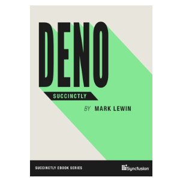

_Deno is a JavaScript runtime by the creator of Node, built upon the lessons learned from Node becoming an integral part of so many apps since 2009, plus the ever-changing web app landscape. In Deno Succinctly, author Mark Lewin illuminates the improvements that Deno brings to server-side web development, and guides readers through three quick projects that demonstrate significant features of the runtime. Regardless of your past experience with Node or other JavaScript runtimes, this ebook will help you get started with Deno quickly and easily._

## TABLE OF CONTENTS

- Introducing Deno
- Deno and Node.js
- Create a URL Shortener Console Application
- Code a Static Site Generator
- Build a RESTful API
- Conclusion and Resources

**You can [download this title for free](https://www.syncfusion.com/succinctly-free-ebooks/download/deno-succinctly) from SyncFusion.**
