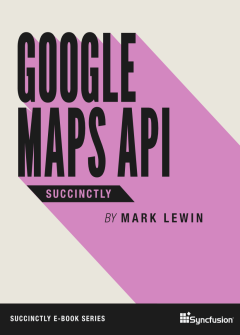

_In Google Maps API Succinctly, Mark Lewin gives you a hands-on, beginner-level introduction to developing mapping applications using the Google Maps JavaScript API. Learn the ins and outs of the API so that you can harness the power of Google Maps within your own websites and applications. Lewin will take you from requesting an API key, through adding overlays, to customizing the generation of directions in your app._

## TABLE OF CONTENTS

- Introduction
- Getting Started
- Customizing the Map Controls
- Adding Data to the Map
- Working with Events
- Geocoding
- Getting Directions
- Conclusion

**You can [download this title for free](https://www.syncfusion.com/succinctly-free-ebooks/confirmation/google-maps-api-succinctly) from SyncFusion.**
