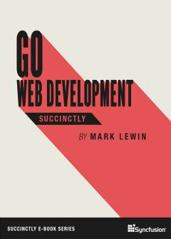

_Go is a modern programming language built to deal with modern programming challenges, such as concurrency and compilation. Designed specifically with the web in mind, Go is an excellent language for writing web applications, specifically for web services. In his second book on Go, Mark Lewin will take you through serving, routing, connecting to a data source, using the templating engine, working with cookies, and more. Use Go Web Development Succinctly to build hugely scalable web applications with ease._

## TABLE OF CONTENTS

- Introduction
- Serving and Routing
- Accessing Data
- Templates
- Creating a RESTful API
- Cookies and Sessions
- Development Techniques

**You can [download this title for free](https://www.syncfusion.com/succinctly-free-ebooks/confirmation/go-web-development) from SyncFusion.**
