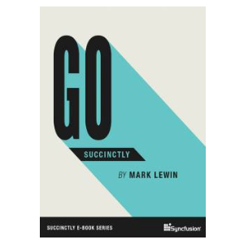

_The Go programming language is relatively small and concise, but its depth makes it an ideal option for solving modern-day development problems. In Go Succinctly, author Mark Lewin guides readers through the basics of Go, and he provides documentation and resources that allow users to dive into the language and learn it for themselves. By the end of the book, novices and experienced programmers alike will be conversant in a language quickly gaining traction around the world._

## TABLE OF CONTENTS

- Welcome
- Introducing Go
- Let’s Go!
- Variables, Constants, and Assignments
- Basic Data Types
- Control Structures
- Arrays, Slices, and Maps
- User-Defined Types
- Concurrency
- Standard Packages
- Go Further

**You can [download this title for free](https://www.syncfusion.com/succinctly-free-ebooks/confirmation/go-succinctly) from SyncFusion.**
