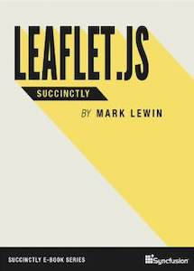

_This introduction to Leaflet.js will teach key concepts of the software and critical techniques in order to help you develop web-ready interactive maps. Mark Lewin's Leaflet.js Succinctly is the first step on the road to producing the best interactive maps you possibly can._

## TABLE OF CONTENTS

- Getting to Know Leaflet.js
- Working with Base Layers
- Adding Overlays
- Handling Events
- Accessing External Data Sources
- Geocoding

**You can [download this title for free](https://www.syncfusion.com/succinctly-free-ebooks/confirmation/leafletjs) from SyncFusion.**
