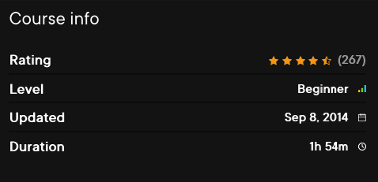

This is a course that I developed and recorded for Pluralsight back in 2014.

I was pretty proud of this one: over 10,000 students took the course, and it received an average of 4.5/5 stars.

The course has now been retired from the main course catalogue, but is still available in Pluralsight's extended library.

## WHAT YOU'LL LEARN

> More details about this course [here](https://www.pluralsight.com/courses/google-maps-api-get-started).
